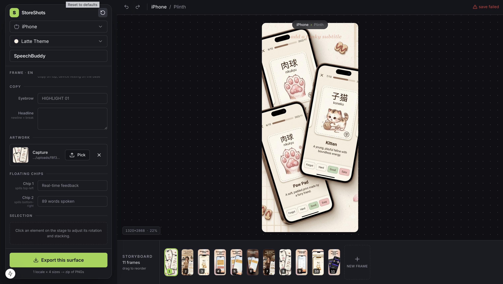

# StoreShots — Play Store and App Store Screenshots Generator

StoreShots is an open-source screenshot studio for shipping better **App Store** and
**Google Play** listing creatives. It hands you (or your coding agent) a ready-made, local-first
Next.js workspace where raw app captures become polished marketing frames — with a live stage,
CSS-rendered device shells, an inspector, per-locale copy, autosaved project state, and
one-tap export bundles at every size the stores require.

[](./LICENSE)

## Demo



## Why StoreShots

Most "screenshot generators" hand you a single template you fight against. StoreShots gives you
a real editor instead: a stage you can drag on, reusable **compositions** for arranging copy and
devices, swappable **palettes** for mood, and exporters that already know every Apple and Google
size. Everything runs on your machine — no account, no upload, no cloud.

## Run It Two Ways

**1. As an agent skill.** Install it into your coding agent with the
[`skills`](https://skills.sh) CLI:

```bash
npx skills add granth16/screenshot-gen-appstore          # this project
npx skills add granth16/screenshot-gen-appstore -g       # global
npx skills add granth16/screenshot-gen-appstore -a cursor  # one agent
```

Compatible with Cursor, Claude Code, Windsurf, Codex, OpenCode, and the other agents the
`skills` CLI supports. The skill itself lives in [`skills/storeshots`](./skills/storeshots).

**2. As a normal app — clone and run.** No agent required:

```bash
git clone https://github.com/granth16/screenshot-gen-appstore
cd screenshot-gen-appstore/skills/storeshots/template
npm install
npm run dev
```

Then open [http://localhost:3000](http://localhost:3000). Full product docs live in
[`skills/storeshots/template/README.md`](./skills/storeshots/template/README.md).

## Inside The Studio

- A live stage rendered at the surface's real resolution and scaled to fit your screen.
- CSS-rendered device shells (no PNG bezels) for iPhone, iPad, and Android phones/tablets.
- Direct manipulation — drag, resize, rotate copy and devices, with layer and rotation controls.
- A per-surface storyboard you can reorder, duplicate, and prune.
- Per-locale copy, so one project carries multiple language sets.
- Autosave to `storeshots.project.json` on disk, mirrored to `localStorage` for instant reloads.
- Drag-and-drop capture uploads landing in `public/captures/uploads/<hash>.png`.
- Bulk export to a zip of deterministic PNGs covering every required store size.

## Compositions & Palettes

Each frame picks a **composition** (how copy and devices are arranged) and the project picks a
**palette** (the colour mood). Mix compositions across a deck for rhythm.

- **Compositions:** `beacon`, `plinth`, `canopy`, `duet`, `manifesto`, `column`, `marquee`.
- **Palettes:** `ink` (dark), `frost` (cool light), `clay` (warm), `lagoon` (teal).

## Surfaces & Export Sizes

Every surface is authored at its largest size and uniformly downscaled on export. Bundles are
organised by `store / surface / locale / <width>x<height>/`.

| Surface | Store | Exported sizes (px) |
|---------|-------|---------------------|
| iPhone | App Store | 1320×2868, 1284×2778, 1206×2622, 1125×2436 |
| iPad | App Store | 2064×2752, 2048×2732 |
| Android phone | Google Play | 1080×1920 |
| Android 7" tablet | Google Play | 1200×1920 (portrait), 1920×1200 (landscape) |
| Android 10" tablet | Google Play | 1600×2560 (portrait), 2560×1600 (landscape) |
| Feature graphic | Google Play | 1024×500 |

## Project File

`storeshots.project.json` is the single source of truth — product name, palette, locales, the
active surface, and a separate deck of frames for each surface. The editor paints from
`localStorage` first for speed, then reconciles with this file. Commit it if you want the deck
reproducible after a fresh clone; leave it ignored to keep working files out of your repo.

## Driving It From An Agent

Once the skill is installed, describe the listing you want and let the agent scaffold and run the
studio. It will gather your app context, captures, surfaces, locales, mood, and frame count first.

Good asks look like:

- *"Screenshots for my plant-care app — reminders, light meter, and a plant ID scanner. Frost palette, 5 iPhone frames."*
- *"Play Store + App Store frames for a freelance invoicing app. Lead with 'get paid faster', clay palette, 6 frames."*
- *"A meditation app deck in English and Spanish. Calm, dark mood, vary the device placement each frame."*

To get the sharpest result, give the agent: one sentence on what the app does, the features
that matter most (ranked), the surfaces and locales you need, the mood (maps to a palette), a
frame count, and any capture paths or an app icon.

## Repository Layout

```txt
skills/
  storeshots/
    SKILL.md        # the agent skill (what gets installed)
    template/       # the StoreShots studio the skill scaffolds
```

## Contributing

Issues and PRs are welcome — especially around export fidelity, new device shells, composition
presets, and copy/design guidance. For anything large, open an issue first so we can align before
you build.

## License

MIT
